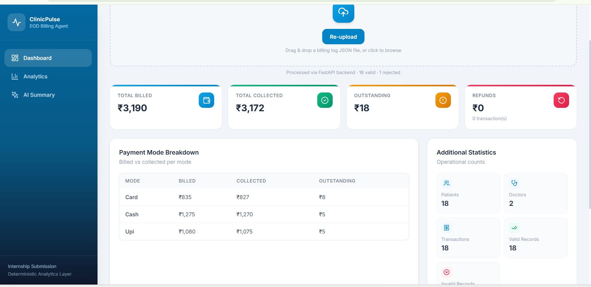
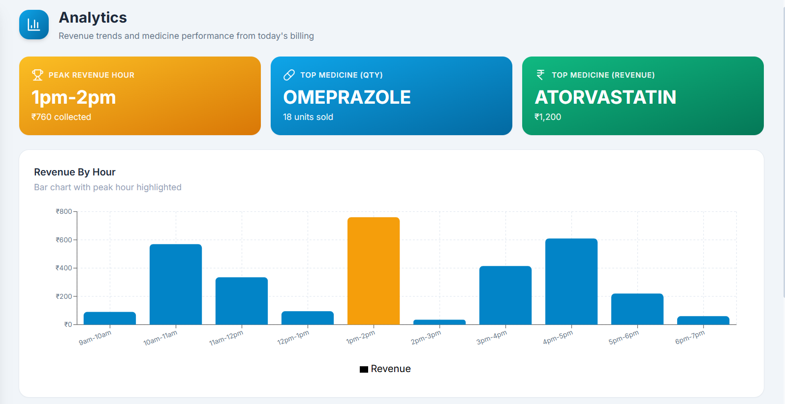
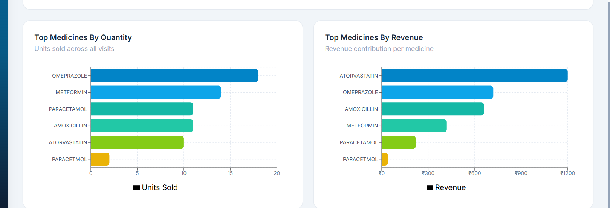
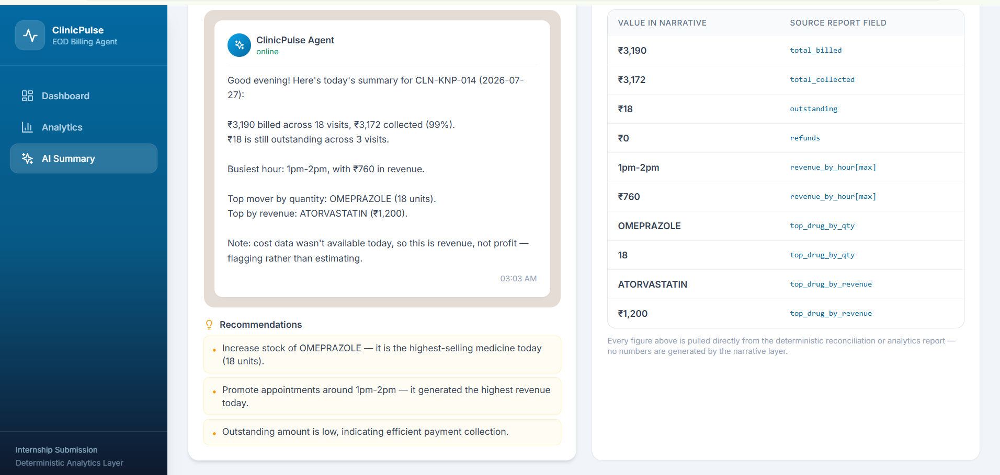
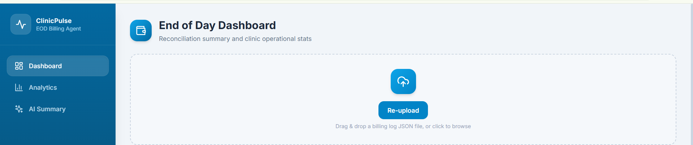

# 🏥 ClinicPulse – End of Day Billing & Analytics Agent

> A full-stack billing analytics platform built using **React** and **FastAPI** that processes clinic billing logs, performs deterministic reconciliation, generates operational analytics, and produces an AI-style business summary with complete traceability.

---

## 📌 Project Overview

ClinicPulse is an End-of-Day (EOD) Billing Analytics Agent designed for healthcare clinics.

The application accepts a clinic billing log (JSON), validates every billing record, performs deterministic reconciliation, generates operational analytics, and presents the results through an interactive dashboard.

A narrative summary is automatically generated from the analytics, ensuring every value displayed can be traced back to the validated billing data.

---

# ✨ Features

## 📊 Billing Dashboard

- Total Billed
- Total Collected
- Outstanding Amount
- Refund Summary
- Payment Mode Breakdown
- Operational Statistics

---

## 📈 Analytics

- Revenue by Hour
- Peak Revenue Hour
- Top Medicines by Quantity
- Top Medicines by Revenue
- Revenue Visualization
- Medicine Performance Charts

---

## 🤖 AI Business Summary

Generates a readable clinic summary including:

- Daily Billing Summary
- Collection Percentage
- Outstanding Payments
- Peak Revenue Hour
- Best Selling Medicine
- Highest Revenue Medicine
- Business Recommendations

---

## 🔍 Traceability

Every value shown in the narrative references deterministic analytics.

No figures are generated independently.

Example:

```
Narrative Value
        │
        ▼
Analytics Report
        │
        ▼
Validated Billing Records
```

This guarantees consistency across the dashboard.

---

# 🏗️ System Architecture

```
                 Billing JSON File
                         │
                         ▼
                 Upload via React
                         │
                         ▼
                 FastAPI REST API
                         │
                         ▼
                  Validation Layer
                         │
                         ▼
              Reconciliation Engine
                         │
                         ▼
                Analytics Generator
                         │
                         ▼
               Narrative Generator
                         │
                         ▼
               React Dashboard UI
```

---

# 🛠️ Technology Stack

## Frontend

- React
- Vite
- Tailwind CSS
- Axios
- Recharts

---

## Backend

- Python
- FastAPI
- Pydantic
- Uvicorn

---

# 📁 Project Structure

```
ClinicPulse-EOD-Agent/

│
├── backend/
│   ├── app/
│   │   ├── api/
│   │   ├── services/
│   │   ├── schemas/
│   │   ├── models/
│   │   ├── utils/
│   │   └── main.py
│   │
│   ├── data/
│   ├── tests/
│   ├── requirements.txt
│   └── README.md
│
├── frontend/
│   ├── src/
│   │   ├── components/
│   │   ├── pages/
│   │   ├── services/
│   │   ├── App.jsx
│   │   └── main.jsx
│   │
│   ├── package.json
│   └── vite.config.js
│
├── screenshots/
│
└── README.md
```

---

# 🚀 REST API

## Health Check

```
GET /api/billing/health
```

Returns the health status of the backend server.

---

## Process Billing Log

```
POST /api/billing/process
```

Uploads a clinic billing log in JSON format and returns:

- Validation Report
- Reconciliation Report
- Analytics Report
- Narrative Summary
- Traceability Data

---

# 📋 API Processing Workflow

```
Billing JSON

↓

Validation

↓

Reconciliation

↓

Analytics

↓

Narrative Generation

↓

Frontend Dashboard
```

---

# ✅ Validation

Each uploaded billing record is validated using **Pydantic models**.

Validation includes:

- Required fields
- Data type validation
- Payment mode validation
- Missing fields
- Refund validation

Invalid records are rejected while valid records continue through the processing pipeline.

---

# 💰 Reconciliation Engine

The reconciliation engine calculates:

- Total Billed
- Total Collected
- Outstanding Amount
- Refund Amount
- Payment Mode Summary

Formula used:

```
Outstanding = Total Billed − Total Collected
```

Refund records are processed independently and excluded from normal revenue calculations.

---

# 📈 Analytics Engine

The analytics module generates:

- Revenue by Hour
- Peak Revenue Hour
- Top Medicines by Quantity
- Top Medicines by Revenue
- Patient Count
- Doctor Count
- Transaction Statistics

Charts displayed in the dashboard are generated directly from deterministic analytics results.

---

# 🤖 Narrative Engine

The AI-style narrative converts structured analytics into a readable clinic summary.

Example:

> ₹3,190 billed across 18 visits.

> ₹3,172 collected (99%).

> Peak revenue hour: 1 PM – 2 PM.

> Top medicine by quantity: OMEPRAZOLE.

> Highest revenue medicine: ATORVASTATIN.

The narrative does **not** calculate values independently.

Every value references the analytics report.

---

# 🔒 Data Consistency

To ensure consistency, the application follows a deterministic processing pipeline.

```
Billing File

↓

Validation

↓

Reconciliation

↓

Analytics

↓

Narrative

↓

Dashboard
```

Benefits:

- Single source of truth
- No duplicated calculations
- Consistent reports
- Fully traceable values

---

# 🖥️ Frontend

The React dashboard provides:

- Billing Overview
- Payment Breakdown
- Revenue Charts
- Medicine Analytics
- AI Narrative
- Traceability Report

The frontend communicates with the FastAPI backend using Axios.

---

# ⚙️ Installation

## Backend

```bash
cd backend

pip install -r requirements.txt

uvicorn app.main:app --reload
```

Backend runs at:

```
http://127.0.0.1:8000
```

Swagger Documentation:

```
http://127.0.0.1:8000/docs
```

---

## Frontend

```bash
cd frontend

npm install

npm run dev
```

Frontend runs at:

```
http://localhost:5173
```

---

# 🌐 Live Demo

## Frontend

> https://your-vercel-url.vercel.app

---

## Backend API

> https://your-render-url.onrender.com

---

## Swagger API Documentation

> https://your-render-url.onrender.com/docs

---

# 📷 Screenshots

## Dashboard



---

## Analytics



---




## AI Summary



---


## Upload Interface



---

# 🧪 Tested Dataset

The application has been tested using multiple billing logs including:

- 25 July 2026
- 26 July 2026
- 27 July 2026

The test cases include:

- Normal Billing Records
- Refund Transactions
- Outstanding Payments
- Invalid Records
- Missing Fields
- Revenue Analytics

---

# 🚀 Future Enhancements

- User Authentication
- Multi-Clinic Support
- Database Integration
- Export Reports (PDF/Excel)
- Email Notifications
- Cloud Storage
- Historical Trend Analysis
- Role-Based Access Control

---

# 👨‍💻 Author

**ClinicPulse – End of Day Billing & Analytics Agent**

Developed as part of the **SwasthiQ Technical Assessment**.

---

# 📄 License

This project is intended for educational and internship evaluation purposes.


